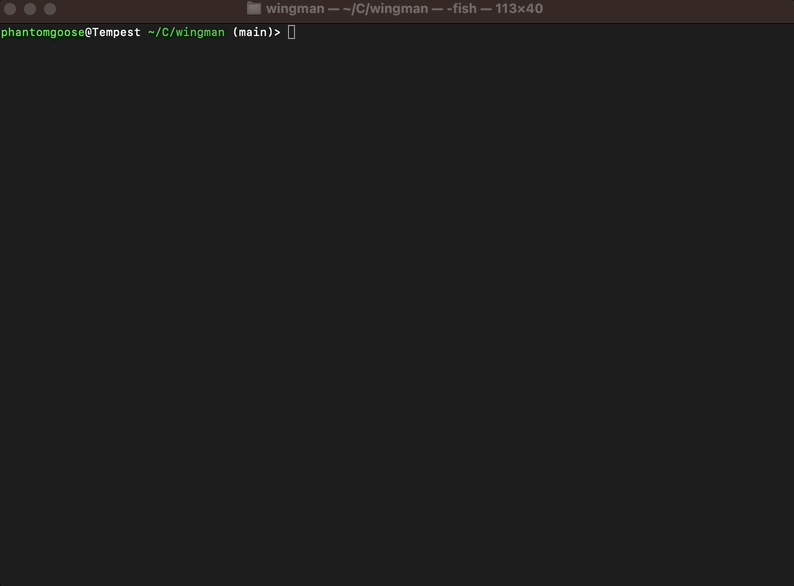

# Wingman

This is a simple Rust CLI for interacting with OpenAI in a similar streaming chatbot fashion as ChatGPT (but in your
terminal).

You'll need to set the `OPENAI_API_KEY` env var in order to use the OpenAI API.

Run with `cargo run`.

